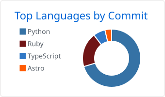
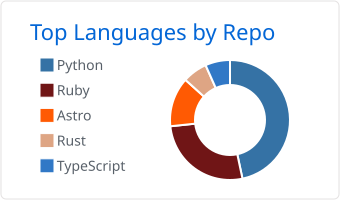

# Hi  I'm Saad Chaudhary

**aka Zaidan Chaudhary**

  
  
  
  

## About Me

I'm a Senior Software Engineer with over six years of experience building full-stack and AI-powered applications. My core stack is **Python, Rust, Ruby on Rails and JavaScript/TypeScript**, along with their frameworks and ecosystems. Over the last few years I've focused heavily on **AI engineering**, particularly NLP, Transformer models and Retrieval-Augmented Generation.

I enjoy working end-to-end, from database and API design through frontend development, Docker, AWS, CI/CD and production deployment.

- 🌍 Based in **Lahore, Pakistan**
- 🚀 Currently building [**Arxiron**](https://arxiron.com), a blood donor platform with real-time tracking, OCR and extensive validation
- 🧠 Currently learning **classical ML**, **Rotary Positional Embeddings** and **LLM architectures**
- 👥 Looking to collaborate on **full-stack applications that solve real business problems**
- 🖥️ Portfolio: [portfolio.arxiron.com](https://portfolio.arxiron.com)
- ✉️ Reach me at [saadchaudhary.dev@gmail.com](mailto:saadchaudhary.dev@gmail.com) or [saad@arxiron.com](mailto:saad@arxiron.com)
- 💬 Ask me about anything. I know more than I could say here, but that's a secret.

## Tech Stack

**Focus areas:** NLP · Transformer models · Retrieval-Augmented Generation (RAG) · end-to-end product engineering

### Languages

### AI, ML & Data

### Python Backend

### Ruby on Rails

### JavaScript & TypeScript

### Styling & Animation

### Databases

### Cloud & DevOps

### Web3, IoT & Services

### Tools & Design

## Languages

<picture>
  <source media="(prefers-color-scheme: dark)" srcset="./profile-summary-card-output/github_dark/2-most-commit-language.svg" />
  
</picture>
<picture>
  <source media="(prefers-color-scheme: dark)" srcset="./profile-summary-card-output/github_dark/1-repos-per-language.svg" />
  
</picture>

