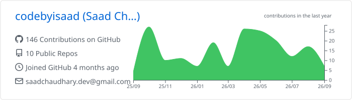
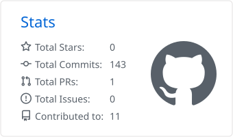

# Hi  I'm Saad Chaudhary

**aka Zaidan Chaudhary**

  
  
  
  

## About Me

I'm a Senior Software Engineer with over six years of experience building full-stack and AI-powered applications. My core stack is **Python, Rust, Ruby on Rails and JavaScript/TypeScript**, along with their frameworks and ecosystems. Over the last few years I've focused heavily on **AI engineering**, particularly NLP, Transformer models and Retrieval-Augmented Generation.

I enjoy working end-to-end, from database and API design through frontend development, Docker, AWS, CI/CD and production deployment.

- 🌍 Based in **Lahore, Pakistan**
- 🚀 Currently building [**Arxiron**](https://arxiron.com), my personal application
- 🧠 Currently learning **classical ML**, **Rotary Positional Embeddings** and **LLM architectures**
- 👥 Looking to collaborate on **full-stack applications that solve real business problems**
- 🖥️ Portfolio: [portfolio.arxiron.com](https://portfolio.arxiron.com)
- ✉️ Reach me at [saadchaudhary.dev@gmail.com](mailto:saadchaudhary.dev@gmail.com)
- 💬 Ask me about anything. I know more than I could say here, but that's a secret.

## Tech Stack

**Languages**

<picture>
  <source media="(prefers-color-scheme: dark)" srcset="https://skillicons.dev/icons?i=py,rust,ruby,ts,js,c,coffeescript,bash&theme=dark" />
  
</picture>

**Frontend**

<picture>
  <source media="(prefers-color-scheme: dark)" srcset="https://skillicons.dev/icons?i=react,nextjs,remix,vue,redux,tailwind,sass&theme=dark" />
  
</picture>

**Backend & Databases**

<picture>
  <source media="(prefers-color-scheme: dark)" srcset="https://skillicons.dev/icons?i=rails,django,fastapi,flask,nodejs,express,mongodb,firebase&theme=dark" />
  
</picture>

**AI / ML**

<picture>
  <source media="(prefers-color-scheme: dark)" srcset="https://skillicons.dev/icons?i=pytorch&theme=dark" />
  
</picture>

**Cloud & DevOps**

<picture>
  <source media="(prefers-color-scheme: dark)" srcset="https://skillicons.dev/icons?i=aws,gcp,docker,kubernetes,heroku,linux,raspberrypi&theme=dark" />
  
</picture>

**Tools & Design**

<picture>
  <source media="(prefers-color-scheme: dark)" srcset="https://skillicons.dev/icons?i=vscode,vim,apple,figma,ps,ai&theme=dark" />
  
</picture>

## GitHub Stats

<picture>
  <source media="(prefers-color-scheme: dark)" srcset="./profile-summary-card-output/github_dark/0-profile-details.svg" />
  
</picture>

<picture>
  <source media="(prefers-color-scheme: dark)" srcset="./profile-summary-card-output/github_dark/3-stats.svg" />
  
</picture>
<picture>
  <source media="(prefers-color-scheme: dark)" srcset="./profile-summary-card-output/github_dark/1-repos-per-language.svg" />
  
</picture>

<picture>
  <source media="(prefers-color-scheme: dark)" srcset="https://streak-stats.demolab.com/?user=codebyisaad&theme=github-dark-blue&hide_border=true" />
  
</picture>

