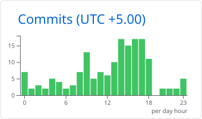

# Hi  I'm Saad Chaudhary

**aka Zaidan Chaudhary**

  
  
  
  

## About Me

I'm a Senior Software Engineer with over six years of experience building full-stack and AI-powered applications. My core stack is **Python, Rust, Ruby on Rails and JavaScript/TypeScript**, along with their frameworks and ecosystems. Over the last few years I've focused heavily on **AI engineering**, particularly NLP, Transformer models and Retrieval-Augmented Generation.

I enjoy working end-to-end, from database and API design through frontend development, Docker, AWS, CI/CD and production deployment.

- 🌍 Based in **Lahore, Pakistan**
- 🚀 Currently building [**Arxiron**](https://arxiron.com), my personal application
- 🧠 Currently learning **classical ML**, **Rotary Positional Embeddings** and **LLM architectures**
- 👥 Looking to collaborate on **full-stack applications that solve real business problems**
- 🖥️ Portfolio: [portfolio.arxiron.com](https://portfolio.arxiron.com)
- ✉️ Reach me at [saadchaudhary.dev@gmail.com](mailto:saadchaudhary.dev@gmail.com)
- 💬 Ask me about anything. I know more than I could say here, but that's a secret.

## Tech Stack

**Focus areas:** NLP · Transformer models · Retrieval-Augmented Generation (RAG) · end-to-end product engineering

### Languages

### AI, ML & Data

### Python Backend

### Ruby on Rails

### JavaScript & TypeScript

### Styling & Animation

### Databases

### Cloud & DevOps

![AWS](https://img.shields.io/badge/AWS-232F3E?style=for-the-badge&logo=data%3Aimage%2Fsvg%2Bxml%3Bbase64%2CPHN2ZyBmaWxsPSIjZmZmIiB2aWV3Qm94PSIwIDAgMTI4IDEyOCIgeG1sbnM9Imh0dHA6Ly93d3cudzMub3JnLzIwMDAvc3ZnIj4KICA8cGF0aCBmaWxsPSIjZjkwIiBkPSJNMTA4LjU5IDI2LjE0OGMtMS44NTIgMC0zLjYyMi4yMTEtNS4zMDUuNzE1LTEuNjg0LjUwNC0zLjExNyAxLjIyMy00LjM3OSAyLjE4OGExMC44MjkgMTAuODI5IDAgMCAwLTMuMDMxIDMuNDUzYy0uNzU3IDEuMzQ4LTEuMTM3IDIuOTA2LTEuMTM3IDQuNjc2IDAgMi4xODcuNzE2IDQuMjUgMi4xMDYgNi4xMDUgMS4zODYgMS44OTUgMy42NiAzLjMyNCA2LjczNCA0LjI5M2w2LjEwNiAxLjg5NWMyLjA2Mi42NzUgMy40OTYgMS4zOTEgNC4yNTQgMi4xOTEuNzU3LjgwMSAxLjEzNiAxLjc2NSAxLjEzNiAyLjk0NSAwIDEuNzI2LS43NTggMy4wNzQtMi4xOTEgNC0xLjQzLjkyNS0zLjQ5MiAxLjM5MS02LjE0NSAxLjM5MS0xLjY4NyAwLTMuMzI4LS4xNjgtNS4wMTEtLjUwNGEyMy4xMDIgMjMuMTAyIDAgMCAxLTQuNjMzLTEuNDc2Yy0uNDIxLS4xNjgtLjgwMS0uMzM2LTEuMDUxLS40MThhMi4zNTcgMi4zNTcgMCAwIDAtLjc1OC0uMTNjLS42MzQgMC0uOTY5LjQyMy0uOTY5IDEuMzA1djIuMTQ5YTIuOTE5IDIuOTE5IDAgMCAwIC4yNTQgMS4xOGMuMTY4LjM4LjYyOS44IDEuMzA1IDEuMTggMS4wOTQuNjI4IDIuNzM0IDEuMTc5IDQuODQgMS42ODMgMi4xMDUuNTA0IDQuMjk3Ljc1OCA2LjQ4NC43NTggMi4xNSAwIDQuMTI5LS4yOTcgNi4wMjQtLjg4MyAxLjgwOC0uNTUxIDMuMzY3LTEuMzA5IDQuNjcyLTIuMzYgMS4zMDQtMS4wMSAyLjMxNi0yLjI3MyAzLjA3NC0zLjcwNy43MTQtMS40MjkgMS4wOTQtMy4wNyAxLjA5NC00Ljg4MiAwLTIuMTg4LS42MzMtNC4xNjgtMS45MzgtNS44OTUtMS4zMDQtMS43MjctMy40OTEtMy4wNzQtNi41MjMtNC4wNDNsLTUuOTgtMS44OTVjLTIuMjMtLjcxMy0zLjc5LTEuNTE2LTQuNjM0LTIuMzE2LS44NC0uNzk3LTEuMjYxLTEuODA4LTEuMjYxLTIuOTg4IDAtMS43MjYuNjcxLTIuOTUgMS45OC0zLjc0NiAxLjMwNS0uODAxIDMuMTk5LTEuMTggNS41OTgtMS4xOCAyLjk4OCAwIDUuNjgzLjU0NyA4LjA4NiAxLjY0LjcxNC4zMzcgMS4yNjEuNTA4IDEuNTk3LjUwOC42MzMgMCAuOTY5LS40NjMuOTY5LTEuMzQ3di0xLjk4YzAtLjU5LS4xMjUtMS4wNTEtLjM3OS0xLjM5MS0uMjUtLjM3OC0uNjcyLS43MTUtMS4yNjItMS4wNTEtLjQyMi0uMjU0LTEuMDExLS41MDQtMS43Ny0uNzU4YTMyLjUyOCAzMi41MjggMCAwIDAtMi4zOTgtLjY3NmMtLjg4Ni0uMTY4LTEuNzY5LS4zMzYtMi43MzgtLjQ2YTIxLjM0NyAyMS4zNDcgMCAwIDAtMi44Mi0uMTY5em0tODYuODIyLjA4MmMtMi4zMTYgMC00LjUwOC4yNTQtNi41Ny44MDEtMi4wNjMuNTA1LTMuODMxIDEuMTM3LTUuMzAzIDEuODk1LS41OS4yOTctLjk3LjU5LTEuMTguODgzLS4yMTEuMjk2LS4yOTMuOC0uMjkzIDEuNDc2djIuMDYzYzAgLjg4Mi4yOTMgMS4zMDQuODgzIDEuMzA0LjE2OCAwIC4zNzgtLjA0My42NzQtLjEyNS4yOTMtLjA4Ni43OTYtLjI1NCAxLjQ3Mi0uNTQ3YTMzLjQxNiAzMy40MTYgMCAwIDEgNC41NDctMS40MzNBMTkuMTc2IDE5LjE3NiAwIDAgMSAyMC41NDcgMzJjMy4yNDIgMCA1LjUxMy42MzMgNi44NjMgMS45MzggMS4zMDQgMS4zMDMgMS45OCAzLjUzNCAxLjk4IDYuNzM0djMuMDc0Yy0xLjY4My0uMzc5LTMuMjgzLS43MTUtNC44NDMtLjkyNi0xLjU1OC0uMjEtMy4wMzEtLjMzNi00LjQ2MS0uMzM2LTQuMzQgMC03Ljc1IDEuMDk0LTEwLjMxNiAzLjI4Ni0yLjU3MSAyLjE4Ny0zLjgzMiA1LjA5My0zLjgzMiA4LjY3MSAwIDMuMzY4IDEuMDUgNi4wNjMgMy4xMTMgOC4wODYgMi4wNjYgMi4wMiA0Ljg4NyAzLjAzMiA4LjQyMiAzLjAzMiA0Ljk3IDAgOS4wOTctMS45MzggMTIuMzc5LTUuODEzYTM0LjE1MyAzNC4xNTMgMCAwIDAgMS4zMDQgMi40ODQgMTMuMjggMTMuMjggMCAwIDAgMS41MTYgMS45OGMuNDIyLjM4Ljg0NC41OSAxLjI2Ni41OS4zMzQgMCAuNzE0LS4xMjggMS4wOTMtLjM3OGwyLjY1My0xLjc3Yy41NDYtLjQyLjgtLjg0My44LTEuMjYxYTEuODYgMS44NiAwIDAgMC0uMjkzLS45NyAyMi40NjkgMjIuNDY5IDAgMCAxLTEuMzQ3LTMuMDNjLS4yOTctLjkyNS0uNDY1LTIuMTktLjQ2NS0zLjc1aC0uMDg2VjQwYzAtNC42MzMtMS4xNzYtOC4wODYtMy40OTItMTAuMzYtMi4zNi0yLjI3My02LjAyNS0zLjQxLTExLjAzMy0zLjQxem0xOS41OCAxLjAxMmMtLjY3NiAwLTEuMDEyLjM3OS0xLjAxMiAxLjA1MSAwIC4yOTcuMTI5Ljg0NC4zNzkgMS42ODdsOS44OTQgMzIuNTQ3Yy4yNTQuOC41NDcgMS4zODcuODg3IDEuNjQxLjMzNi4yOTcuODQuNDIyIDEuNTk4LjQyMmgzLjYyYy43NTkgMCAxLjM0Ny0uMTI1IDEuNjg0LS40MjIuMzQtLjI5My41OTEtLjg0LjgwMS0xLjY4NGw2LjQ4NS0yNy4xMTcgNi41MjcgMjcuMTZjLjE2OC44NC40NiAxLjM4Ny44IDEuNjg0LjMzNy4yOTIuODgzLjQyMiAxLjY4NC40MjJoMy42MjFjLjcxNSAwIDEuMjYyLS4xNjcgMS41OTgtLjQyMi4zNC0uMjUzLjYzMy0uOC44ODctMS42NEw5MC45NDkgMzAuMDJjLjE2OC0uNDYuMjUtLjc5Ny4yOTMtMS4wNTEuMDQzLS4yNTQuMDg2LS40NjYuMDg2LS42NzYgMC0uNzE1LS4zNzktMS4wNS0xLjA1NS0xLjA1SDg2LjM2Yy0uNzU3IDAtMS4zMDguMTY2LTEuNjQ0LjQyMS0uMjkzLjI1LS41OS44LS44NCAxLjY0TDc2LjU5IDU3LjUxN2wtNi42NTMtMjguMjExYy0uMTY2LS44LS40NjQtMS4zOS0uOC0xLjY0LS4zMzYtLjI5OC0uODg0LS40MjMtMS42ODQtLjQyM2gtMy4zNjdjLS43NTggMC0xLjM0OC4xNjctMS42ODguNDIyLS4zMzUuMjUtLjU4OC44LS43OTYgMS42NGwtNi41NyAyNy44NzYtNy4wNzUtMjcuODc1Yy0uMjUtLjgtLjUwNC0xLjM5LS44NC0xLjY0LS4yOTctLjI5OC0uODQ0LS40MjMtMS42NDQtLjQyM2gtNC4xMjV6TTIxLjY0IDQ3LjQ5NmEzMS44MTYgMzEuODE2IDAgMCAxIDMuOTYuMjUgMzQuNDAxIDM0LjQwMSAwIDAgMSAzLjg3Mi43MTl2MS43NjVjMCAxLjQzNS0uMTY4IDIuNjUzLS40MjIgMy42NjUtLjI1IDEuMDEtLjc1OCAxLjg5NS0xLjQzIDIuNjk1LTEuMTM3IDEuMjYyLTIuNDg0IDIuMTg3LTQgMi42OTUtMS41MTYuNTA0LTIuOTQ5Ljc1OC00LjMzNi43NTgtMS45MzcgMC0zLjQxLS41MDgtNC40MjItMS41NTktMS4wNTQtMS4wMS0xLjU1OC0yLjQ4NC0xLjU1OC00LjQ2NCAwLTIuMTA2LjY3NS0zLjcwNCAyLjA2Mi00Ljg0IDEuMzkxLTEuMTM3IDMuNDU0LTEuNjg0IDYuMjc0LTEuNjg0ek0xMTggNzMuMzQ4Yy00LjQzMi4wNjMtOS42NjQgMS4wNTItMTMuNjIxIDMuODMyLTEuMjIzLjg4My0xLjAxMiAyLjA2Mi4zMzYgMS44OTQgNC41MDgtLjU0NyAxNC40NC0xLjcyNiAxNi4yMS41NDcgMS43NyAyLjIzLTEuOTc2IDExLjYyLTMuNjYzIDE1Ljc5LS41MDQgMS4yNi41OSAxLjc2OSAxLjcyNi44IDcuNDEtNi4yMzEgOS4zNDgtMTkuMjQyIDcuODMyLTIxLjEzNy0uNzU3LS45MjUtNC4zODgtMS43OS04LjgyLTEuNzI2ek0xLjYzIDc1Ljg1OWMtLjkyNi4xMTYtMS4zNDcgMS4yMzYtLjM2OCAyLjEyMSAxNi41MDggMTQuOTAyIDM4LjM1OSAyMy44NzIgNjIuNjEzIDIzLjg3MiAxNy4zMDUgMCAzNy40My01LjQzIDUxLjI4MS0xNS42NiAyLjI3My0xLjY4OS4yOTgtNC4yNTQtMi4wMi0zLjIwNC0xNS41MzMgNi41Ny0zMi40MjEgOS43Ny00Ny43ODggOS43Ny0yMi43NzggMC00NC44LTYuMjczLTYyLjY1My0xNi42MzMtLjM5LS4yMzEtLjc1NS0uMzA0LTEuMDY0LS4yNjZ6Ii8%2BCjwvc3ZnPgo%3D)

### Web3, IoT & Services

### Tools & Design

![VS Code](https://img.shields.io/badge/VS_Code-007ACC?style=for-the-badge&logo=data%3Aimage%2Fsvg%2Bxml%3Bbase64%2CPHN2ZyB4bWxucz0iaHR0cDovL3d3dy53My5vcmcvMjAwMC9zdmciIHZpZXdCb3g9IjAgMCAxMjggMTI4Ij48bWFzayBpZD0iYSIgd2lkdGg9IjEyOCIgaGVpZ2h0PSIxMjgiIHg9IjAiIHk9IjAiIG1hc2tVbml0cz0idXNlclNwYWNlT25Vc2UiIHN0eWxlPSJtYXNrLXR5cGU6YWxwaGEiPjxwYXRoIGZpbGw9IiNmZmYiIGZpbGwtcnVsZT0iZXZlbm9kZCIgZD0iTTkwLjc2NyAxMjcuMTI2YTcuOTY4IDcuOTY4IDAgMCAwIDYuMzUtLjI0NGwyNi4zNTMtMTIuNjgxYTggOCAwIDAgMCA0LjUzLTcuMjA5VjIxLjAwOWE4IDggMCAwIDAtNC41My03LjIxTDk3LjExNyAxLjEyYTcuOTcgNy45NyAwIDAgMC05LjA5MyAxLjU0OGwtNTAuNDUgNDYuMDI2TDE1LjYgMzIuMDEzYTUuMzI4IDUuMzI4IDAgMCAwLTYuODA3LjMwMmwtNy4wNDggNi40MTFhNS4zMzUgNS4zMzUgMCAwIDAtLjAwNiA3Ljg4OEwyMC43OTYgNjQgMS43NCA4MS4zODdhNS4zMzYgNS4zMzYgMCAwIDAgLjAwNiA3Ljg4N2w3LjA0OCA2LjQxMWE1LjMyNyA1LjMyNyAwIDAgMCA2LjgwNy4zMDNsMjEuOTc0LTE2LjY4IDUwLjQ1IDQ2LjAyNWE3Ljk2IDcuOTYgMCAwIDAgMi43NDMgMS43OTNabTUuMjUyLTkyLjE4M0w1Ny43NCA2NGwzOC4yOCAyOS4wNThWMzQuOTQzWiIgY2xpcC1ydWxlPSJldmVub2RkIi8%2BPC9tYXNrPjxnIG1hc2s9InVybCgjYSkiPjxwYXRoIGZpbGw9IiMwMDY1QTkiIGQ9Ik0xMjMuNDcxIDEzLjgyIDk3LjA5NyAxLjEyQTcuOTczIDcuOTczIDAgMCAwIDg4IDIuNjY4TDEuNjYyIDgxLjM4N2E1LjMzMyA1LjMzMyAwIDAgMCAuMDA2IDcuODg3bDcuMDUyIDYuNDExYTUuMzMzIDUuMzMzIDAgMCAwIDYuODExLjMwM2wxMDMuOTcxLTc4Ljg3NWMzLjQ4OC0yLjY0NiA4LjQ5OC0uMTU4IDguNDk4IDQuMjJ2LS4zMDZhOC4wMDEgOC4wMDEgMCAwIDAtNC41MjktNy4yMDhaIi8%2BPGcgZmlsdGVyPSJ1cmwoI2IpIj48cGF0aCBmaWxsPSIjMDA3QUNDIiBkPSJtMTIzLjQ3MSAxMTQuMTgxLTI2LjM3NCAxMi42OThBNy45NzMgNy45NzMgMCAwIDEgODggMTI1LjMzM0wxLjY2MiA0Ni42MTNhNS4zMzMgNS4zMzMgMCAwIDEgLjAwNi03Ljg4N2w3LjA1Mi02LjQxMWE1LjMzMyA1LjMzMyAwIDAgMSA2LjgxMS0uMzAzbDEwMy45NzEgNzguODc0YzMuNDg4IDIuNjQ3IDguNDk4LjE1OSA4LjQ5OC00LjIxOXYuMzA2YTguMDAxIDguMDAxIDAgMCAxLTQuNTI5IDcuMjA4WiIvPjwvZz48ZyBmaWx0ZXI9InVybCgjYykiPjxwYXRoIGZpbGw9IiMxRjlDRjAiIGQ9Ik05Ny4wOTggMTI2Ljg4MkE3Ljk3NyA3Ljk3NyAwIDAgMSA4OCAxMjUuMzMzYzIuOTUyIDIuOTUyIDggLjg2MSA4LTMuMzE0VjUuOThjMC00LjE3NS01LjA0OC02LjI2Ni04LTMuMzEzYTcuOTc3IDcuOTc3IDAgMCAxIDkuMDk4LTEuNTQ5TDEyMy40NjcgMTMuOEE4IDggMCAwIDEgMTI4IDIxLjAxdjg1Ljk4MmE4IDggMCAwIDEtNC41MzMgNy4yMWwtMjYuMzY5IDEyLjY4MVoiLz48L2c%2BPHBhdGggZmlsbD0idXJsKCNkKSIgZmlsbC1ydWxlPSJldmVub2RkIiBkPSJNOTAuNjkgMTI3LjEyNmE3Ljk2OCA3Ljk2OCAwIDAgMCA2LjM0OS0uMjQ0bDI2LjM1My0xMi42ODFhOCA4IDAgMCAwIDQuNTMtNy4yMVYyMS4wMDlhOCA4IDAgMCAwLTQuNTMtNy4yMUw5Ny4wMzkgMS4xMmE3Ljk3IDcuOTcgMCAwIDAtOS4wOTMgMS41NDhsLTUwLjQ1IDQ2LjAyNi0yMS45NzQtMTYuNjhhNS4zMjggNS4zMjggMCAwIDAtNi44MDcuMzAybC03LjA0OCA2LjQxMWE1LjMzNiA1LjMzNiAwIDAgMC0uMDA2IDcuODg4TDIwLjcxOCA2NCAxLjY2MiA4MS4zODZhNS4zMzUgNS4zMzUgMCAwIDAgLjAwNiA3Ljg4OGw3LjA0OCA2LjQxMWE1LjMyOCA1LjMyOCAwIDAgMCA2LjgwNy4zMDNsMjEuOTc1LTE2LjY4MSA1MC40NSA0Ni4wMjZhNy45NTkgNy45NTkgMCAwIDAgMi43NDIgMS43OTNabTUuMjUyLTkyLjE4NEw1Ny42NjIgNjRsMzguMjggMjkuMDU3VjM0Ljk0M1oiIGNsaXAtcnVsZT0iZXZlbm9kZCIgb3BhY2l0eT0iMC4yNSIgc3R5bGU9Im1peC1ibGVuZC1tb2RlOm92ZXJsYXkiLz48L2c%2BPGRlZnM%2BPGZpbHRlciBpZD0iYiIgd2lkdGg9IjE0NC43NDQiIGhlaWdodD0iMTEzLjQwOCIgeD0iLTguNDExMTUiIHk9IjIyLjU5NDQiIGNvbG9yLWludGVycG9sYXRpb24tZmlsdGVycz0ic1JHQiIgZmlsdGVyVW5pdHM9InVzZXJTcGFjZU9uVXNlIj48ZmVGbG9vZCBmbG9vZC1vcGFjaXR5PSIwIiByZXN1bHQ9IkJhY2tncm91bmRJbWFnZUZpeCIvPjxmZUNvbG9yTWF0cml4IGluPSJTb3VyY2VBbHBoYSIgcmVzdWx0PSJoYXJkQWxwaGEiIHZhbHVlcz0iMCAwIDAgMCAwIDAgMCAwIDAgMCAwIDAgMCAwIDAgMCAwIDAgMTI3IDAiLz48ZmVPZmZzZXQvPjxmZUdhdXNzaWFuQmx1ciBzdGREZXZpYXRpb249IjQuMTY2NjciLz48ZmVDb2xvck1hdHJpeCB2YWx1ZXM9IjAgMCAwIDAgMCAwIDAgMCAwIDAgMCAwIDAgMCAwIDAgMCAwIDAuMjUgMCIvPjxmZUJsZW5kIGluMj0iQmFja2dyb3VuZEltYWdlRml4IiBtb2RlPSJvdmVybGF5IiByZXN1bHQ9ImVmZmVjdDFfZHJvcFNoYWRvd18xXzM2Ii8%2BPGZlQmxlbmQgaW49IlNvdXJjZUdyYXBoaWMiIGluMj0iZWZmZWN0MV9kcm9wU2hhZG93XzFfMzYiIHJlc3VsdD0ic2hhcGUiLz48L2ZpbHRlcj48ZmlsdGVyIGlkPSJjIiB3aWR0aD0iNTYuNjY2NyIgaGVpZ2h0PSIxNDQuMDA3IiB4PSI3OS42NjY3IiB5PSItOC4wMDM1IiBjb2xvci1pbnRlcnBvbGF0aW9uLWZpbHRlcnM9InNSR0IiIGZpbHRlclVuaXRzPSJ1c2VyU3BhY2VPblVzZSI%2BPGZlRmxvb2QgZmxvb2Qtb3BhY2l0eT0iMCIgcmVzdWx0PSJCYWNrZ3JvdW5kSW1hZ2VGaXgiLz48ZmVDb2xvck1hdHJpeCBpbj0iU291cmNlQWxwaGEiIHJlc3VsdD0iaGFyZEFscGhhIiB2YWx1ZXM9IjAgMCAwIDAgMCAwIDAgMCAwIDAgMCAwIDAgMCAwIDAgMCAwIDEyNyAwIi8%2BPGZlT2Zmc2V0Lz48ZmVHYXVzc2lhbkJsdXIgc3RkRGV2aWF0aW9uPSI0LjE2NjY3Ii8%2BPGZlQ29sb3JNYXRyaXggdmFsdWVzPSIwIDAgMCAwIDAgMCAwIDAgMCAwIDAgMCAwIDAgMCAwIDAgMCAwLjI1IDAiLz48ZmVCbGVuZCBpbjI9IkJhY2tncm91bmRJbWFnZUZpeCIgbW9kZT0ib3ZlcmxheSIgcmVzdWx0PSJlZmZlY3QxX2Ryb3BTaGFkb3dfMV8zNiIvPjxmZUJsZW5kIGluPSJTb3VyY2VHcmFwaGljIiBpbjI9ImVmZmVjdDFfZHJvcFNoYWRvd18xXzM2IiByZXN1bHQ9InNoYXBlIi8%2BPC9maWx0ZXI%2BPGxpbmVhckdyYWRpZW50IGlkPSJkIiB4MT0iNjMuOTIyMiIgeDI9IjYzLjkyMjIiIHkxPSIwLjMyOTkwMiIgeTI9IjEyNy42NyIgZ3JhZGllbnRVbml0cz0idXNlclNwYWNlT25Vc2UiPjxzdG9wIHN0b3AtY29sb3I9IiNmZmYiLz48c3RvcCBvZmZzZXQ9IjEiIHN0b3AtY29sb3I9IiNmZmYiIHN0b3Atb3BhY2l0eT0iMCIvPjwvbGluZWFyR3JhZGllbnQ%2BPC9kZWZzPjwvc3ZnPgo%3D)

![Photoshop](https://img.shields.io/badge/Photoshop-001E36?style=for-the-badge&logo=data%3Aimage%2Fsvg%2Bxml%3Bbase64%2CPHN2ZyB4bWxucz0iaHR0cDovL3d3dy53My5vcmcvMjAwMC9zdmciIHZpZXdCb3g9IjAgMCAxMjggMTI4Ij48cGF0aCBmaWxsPSIjMzFBOEZGIiBkPSJNMjIuNjY2IDEuNkMxMC4xMzMgMS42IDAgMTEuNzM0IDAgMjQuMjY4djc5LjQ2NEMwIDExNi4yNjYgMTAuMTMzIDEyNi40IDIyLjY2NiAxMjYuNGg4Mi42NjhjMTIuNTMzIDAgMjIuNjY2LTEwLjEzNCAyMi42NjYtMjIuNjY4VjI0LjI2OEMxMjggMTEuNzM0IDExNy44NjcgMS42IDEwNS4zMzQgMS42SDIyLjY2NnptMjMuMjAxIDMxLjczNGM0LjM3MyAwIDggLjUzMiAxMC45ODYgMS42NTJBMTkuMDUgMTkuMDUgMCAwIDEgNjQgMzkuMzYxYTE2Ljk3NiAxNi45NzYgMCAwIDEgMy44OTQgNi4wNzljLjggMi4yNCAxLjIyNSA0LjUzMyAxLjIyNSA2LjkzMyAwIDQuNTg3LTEuMDY2IDguMzczLTMuMiAxMS4zNi0yLjEzMiAyLjk4Ni01LjExOCA1LjIyNy04LjU4NSA2LjUwNy0zLjYyNyAxLjMzNC03LjYyNyAxLjgxMy0xMiAxLjgxMy0xLjI4IDAtMi4xMzUgMC0yLjY2OC0uMDUzLS41MzMtLjA1My0xLjI4LS4wNTMtMi4yOTMtLjA1M3YxNy4xMmMuMDUzLjM3My0uMjEzLjY5NC0uNTg2Ljc0N0gyOS40NGMtLjQyNiAwLS42MzgtLjIxNS0uNjM4LS42OTVWMzQuMjRjMC0uMzczLjE2LS41ODguNTMzLS41ODguOTA3IDAgMS43NiAwIDIuOTg2LS4wNTIgMS4yOC0uMDU0IDIuNjEzLS4wNTIgNC4wNTMtLjEwNiAxLjQ0LS4wNTMgMi45ODctLjA1NCA0LjY0LS4xMDcgMS42NTQtLjA1NCAzLjI1NC0uMDUzIDQuODU0LS4wNTN6bTEuMTkgMTAuNTA0YTE4LjY4IDE4LjY4IDAgMCAwLS44MTcuMDAyYy0xLjM4NiAwLTIuNjEzLjAwMS0zLjYyNy4wNTUtMS4wNjYtLjA1NC0xLjgxMi0uMDAxLTIuMTg1LjA1MnYxNy45MmMuNzQ2LjA1NCAxLjQzOC4xMDYgMi4wNzguMTA2aDIuODI4YzIuMDggMCA0LjE2LS4zMiA2LjEzMy0uOTYgMS43MDctLjQ4IDMuMi0xLjQ5NCA0LjM3My0yLjgyNyAxLjEyLTEuMzM0IDEuNjU0LTMuMTQ2IDEuNjU0LTUuNDkzYTguNzc2IDguNzc2IDAgMCAwLTEuMjI2LTQuNzQ2Yy0uOTA3LTEuMzg2LTIuMTg4LTIuNDU0LTMuNzM1LTMuMDQtMS43MjctLjctMy41NzYtMS4wMzMtNS40NzYtMS4wN3ptNDQuNzMgMi43MjNjMi4xODcgMCA0LjQyNy4xNTggNi42MTMuNDc4IDEuNi4yMTMgMy4xNDYuNjQyIDQuNTg2IDEuMjI5LjIxNC4wNTMuNDI3LjI2NS41MzMuNDc4LjA1NC4yMTMuMTA4LjQyNy4xMDguNjR2OC42OTRhLjY1NS42NTUgMCAwIDEtLjI2Ni41MzNjLS40OC4xMDctLjc0Ny4xMDctLjk2IDAtMS42LS44NTMtMy4zMDgtMS40MzktNS4xMjItMS44MTItMS45NzMtLjQyNy0zLjk0Ni0uNjk1LTUuOTcyLS42OTUtMS4wNjctLjA1NC0yLjE4OC4xMDgtMy4yMDEuMzc0LS42OTQuMTYtMS4yOC41MzQtMS42NTMgMS4wNjctLjI2Ni40MjctLjQyNi45Ni0uNDI2IDEuNDRzLjIxNC45Ni41MzQgMS4zODZjLjQ4LjU4NyAxLjExOSAxLjA2OCAxLjgxMiAxLjQ0MmE0OC44IDQ4LjggMCAwIDAgMy43ODcgMS43NTdjMi44OC45NiA1LjY1MyAyLjI5NSA4LjIxMyAzLjg5NSAxLjc2IDEuMTIgMy4yIDIuNjE0IDQuMjEzIDQuNDI3YTExLjUwOSAxMS41MDkgMCAwIDEgMS4yMjggNS40OTMgMTIuNDEyIDEyLjQxMiAwIDAgMS0yLjA4MiA3LjA5MyAxMy4zNjIgMTMuMzYyIDAgMCAxLTUuOTcyIDQuNzQ2Yy0yLjYxNCAxLjEyLTUuODE0IDEuNzA3LTkuNjU0IDEuNzA3LTIuNDU0IDAtNC44NTItLjIxMy03LjI1Mi0uNjkzYTIxLjUxIDIxLjUxIDAgMCAxLTUuNDQtMS43MDdjLS4zNzMtLjIxMy0uNjQxLS41ODctLjU4OC0xLjAxNFY3OC4yNGMwLS4xNi4wNTMtLjM3NC4yMTMtLjQ4LjE2LS4xMDcuMzItLjA1Mi40OC4wNTRhMjIuODMgMjIuODMgMCAwIDAgNi42MTQgMi42MTRjMi4wMjcuNTMzIDQuMTYxLjc5OSA2LjI5NS43OTkgMi4wMjYgMCAzLjQ2Ni0uMjY3IDQuNDI2LS43NDcuODUzLS4zNzMgMS40MzktMS4yOCAxLjQzOS0yLjI0IDAtLjc0Ni0uNDI2LTEuNDQxLTEuMjgtMi4xMzUtLjg1My0uNjkzLTIuNjEzLTEuNDkyLTUuMjI2LTIuNTA1YTMyLjYzOCAzMi42MzggMCAwIDEtNy41NzQtMy44NCAxMy44MSAxMy44MSAwIDAgMS00LjA1My00LjUzMyAxMS40NCAxMS40NCAwIDAgMS0xLjIyNi01LjQ0YzAtMi4yOTMuNjM5LTQuNDggMS44MTItNi40NTMgMS4zMzMtMi4xMzMgMy4zMDgtMy44NCA1LjYwMi00LjkwNiAyLjUwNi0xLjI4IDUuNjUyLTEuODY3IDkuNDQtMS44Njd6Ii8%2BPC9zdmc%2BCg%3D%3D)
![Illustrator](https://img.shields.io/badge/Illustrator-330000?style=for-the-badge&logo=data%3Aimage%2Fsvg%2Bxml%3Bbase64%2CPHN2ZyB4bWxucz0iaHR0cDovL3d3dy53My5vcmcvMjAwMC9zdmciIGRhdGEtbmFtZT0iTGF5ZXIgMSIgdmlld0JveD0iMCAwIDEyOCAxMjgiPjxwYXRoIGZpbGw9IiNGRjlBMDAiIGQ9Ik0xMDUuMzMgMS42SDIyLjY3QTIyLjY0IDIyLjY0IDAgMCAwIDAgMjQuMjd2NzkuNDZhMjIuNjQgMjIuNjQgMCAwIDAgMjIuNjcgMjIuNjdoODIuNjZBMjIuNjQgMjIuNjQgMCAwIDAgMTI4IDEwMy43M1YyNC4yN0EyMi42NCAyMi42NCAwIDAgMCAxMDUuMzMgMS42Wm0tMjcuMDkgODhINjcuMDlhLjgyLjgyIDAgMCAxLS44NS0uNTlsLTQuMzctMTIuNzRINDJMMzggODguOGEuOTMuOTMgMCAwIDEtMSAuNzVIMjdjLS41OCAwLS43NC0uMzItLjU4LTFsMTcuMS00OS40Yy4xNi0uNTQuMzItMS4xMi41My0xLjc2YTE4LjE0IDE4LjE0IDAgMCAwIC4zMi0zLjQ3LjU0LjU0IDAgMCAxIC40My0uNTloMTMuODFjLjQzIDAgLjY0LjE2LjcuNDNsMTkuNDYgNTQuOTNjLjE2LjU5IDAgLjg2LS41My44NlptMTguNC0uNmMwIC41OS0uMjEuODUtLjY5Ljg1SDg1LjQ5YS43NS43NSAwIDAgMS0uOC0uODVWNDcuODljMC0uNTMuMjItLjc0LjctLjc0SDk2Yy40OCAwIC42OS4yNi42OS43NFptLTEuMTItNDguMmE2LjMgNi4zIDAgMCAxLTQuODUgMS44NyA2LjYxIDYuNjEgMCAwIDEtNC43NS0xLjg3IDYuODcgNi44NyAwIDAgMS0xLjgxLTQuOTFBNi4yMyA2LjIzIDAgMCAxIDg2IDMxLjE1YTYuOCA2LjggMCAwIDEgNC43NC0xLjg3IDYuNCA2LjQgMCAwIDEgNC44NiAxLjg3IDYuNzUgNi43NSAwIDAgMSAxLjc2IDQuNzQgNi43NiA2Ljc2IDAgMCAxLTEuODQgNC45MVpNNTguNjcgNjUuNDRINDUuMTJjLjgtMi4yNCAxLjYtNC43NSAyLjM1LTcuNDdzMS42NS01LjMzIDIuNDUtNy44OWE2NC42NSA2NC42NSAwIDAgMCAxLjgxLTYuODhoLjExYy4zNyAxLjI4Ljc1IDIuNjcgMS4xNyA0LjE2cy45MSAzLjA5IDEuNDQgNC43NSAxIDMuMjUgMS41NSA0LjkgMSAzLjE1IDEuNDQgNC41OS45MSAyLjcyIDEuMjMgMy44NFoiLz48L3N2Zz4K)

## GitHub Stats

<picture>
  <source media="(prefers-color-scheme: dark)" srcset="./profile-summary-card-output/github_dark/3-stats.svg" />
  
</picture>
<picture>
  <source media="(prefers-color-scheme: dark)" srcset="./profile-summary-card-output/github_dark/2-most-commit-language.svg" />
  
</picture>

<picture>
  <source media="(prefers-color-scheme: dark)" srcset="./profile-summary-card-output/github_dark/1-repos-per-language.svg" />
  
</picture>
<picture>
  <source media="(prefers-color-scheme: dark)" srcset="./profile-summary-card-output/github_dark/4-productive-time.svg" />
  
</picture>

<picture>
  <source media="(prefers-color-scheme: dark)" srcset="https://streak-stats.demolab.com/?user=codebyisaad&theme=github-dark-blue&hide_border=true" />
  
</picture>

